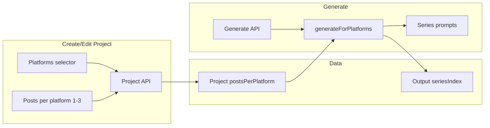

# План: серия постов на платформу (Enterprise)

## Текущее состояние

- **Выбор при создании проекта:** только платформы ([`components/projects/new-project-flow.tsx`](components/projects/new-project-flow.tsx), [`components/projects/project-form.tsx`](components/projects/project-form.tsx)). Данные: `Project.platforms: string[]`, валидация в [`lib/validations/project.ts`](lib/validations/project.ts).
- **Output:** один пост на пару (projectId, platform) — в Prisma [`@@unique([projectId, platform])`](prisma/schema.prisma) в модели `Output`. Генерация в [`lib/services/ai.ts`](lib/services/ai.ts) через `generateForPlatforms` с upsert по `projectId_platform`.
- **Подписки:** Enterprise уже имеет `maxOutputsPerProject: 10` в [`lib/constants/plans.ts`](lib/constants/plans.ts). Фичи плана отдаются в [`app/api/subscription/features/route.ts`](app/api/subscription/features/route.ts).
- **Редактор:** выходы редактируются по `outputId` ([`app/(dashboard)/projects/[id]/outputs/[outputId]/edit/page.tsx`](app/(dashboard)/projects/[id]/outputs/[outputId]/edit/page.tsx)); ссылки с generate page уже используют `outputId`.

## Целевое поведение (Enterprise)

- При создании/редактировании проекта пользователь с планом Enterprise может выбрать **число постов на платформу: 1, 2 или 3** (по умолчанию 1).
- При генерации для каждой платформы создаётся **серия из N постов**, связанных по смыслу:
  - **Пост 1:** зацепка, намёк на тему, без раскрытия сути.
  - **Пост 2:** больше контекста, ожидание, без полного вывода.
  - **Пост 3:** полное раскрытие темы и CTA.
- Ограничение: `platforms.length * postsPerPlatform <= maxOutputsPerProject` (для Enterprise 10).

## Архитектура изменений

## 1. Модель данных и миграция

**Файл:** [`prisma/schema.prisma`](prisma/schema.prisma)

- **Project:** добавить поле `postsPerPlatform Int?` (1, 2 или 3). Значение только для Enterprise; при создании/обновлении проверять план и лимит.
- **Output:**  
  - Добавить `seriesIndex Int @default(1)` (1-based номер поста в серии на данной платформе).  
  - Удалить `@@unique([projectId, platform])`.  
  - Добавить `@@unique([projectId, platform, seriesIndex])`.

Миграция: для существующих записей `Output` установить `seriesIndex = 1` (default покроет новые строки; для уже существующих — в миграции SQL `UPDATE outputs SET series_index = 1 WHERE series_index IS NULL` если поле будет добавлено как nullable на переходный период, иначе при `@default(1)` достаточно добавить колонку с default).

**Валидация при создании/обновлении проекта:**

`platforms.length * (postsPerPlatform ?? 1) <= PLAN_LIMITS[plan].maxOutputsPerProject`. Для non-enterprise `postsPerPlatform` не передавать или принудительно 1. При **PATCH** проекта повторно проверять лимит: при изменении платформ или `postsPerPlatform` новое значение `platforms.length * postsPerPlatform` не должно превышать лимит плана.

## 2. API и валидация проектов

- **[`lib/validations/project.ts`](lib/validations/project.ts):** в схемах создания/обновления добавить опциональное поле `postsPerPlatform: z.union([z.literal(1), z.literal(2), z.literal(3)]).optional()`. При наличии проверять (refine) что `platforms.length * postsPerPlatform <= maxOutputsPerProject` (max передавать из контекста или взять константу enterprise 10).
- **[`app/api/projects/route.ts`](app/api/projects/route.ts)** (POST): читать план пользователя; если не enterprise, игнорировать или принудительно ставить `postsPerPlatform = 1`. Иначе сохранять `postsPerPlatform` в БД. Проверка лимита outputs при сохранении.
- **[`app/api/projects/[id]/route.ts`](app/api/projects/[id]/route.ts)** (PATCH, GET): при PATCH принимать и валидировать `postsPerPlatform` (только для enterprise); при GET возвращать поле в объекте проекта.

## 3. Подписка и фичи Enterprise

- **[`app/api/subscription/features/route.ts`](app/api/subscription/features/route.ts):** для плана `enterprise` добавить в ответ: `canUseSeries: true`, `maxPostsPerPlatform: 3`. Для остальных планов — `canUseSeries: false`, `maxPostsPerPlatform: 1`.
- **[`lib/constants/plans.ts`](lib/constants/plans.ts):** при необходимости добавить в `PLAN_LIMITS.enterprise` константу `maxPostsPerPlatform: 3` для единого места проверок (опционально).

## 4. UI: выбор числа постов на платформу (Enterprise)

- **[`components/projects/new-project-flow.tsx`](components/projects/new-project-flow.tsx):** при создании проекта из аудио запрашивать `/api/subscription/features`; если `canUseSeries === true`, под блоком выбора платформ показать селектор "Posts per platform" (1 / 2 / 3). Значение передавать в body POST `/api/projects` как `postsPerPlatform`.
- **[`components/projects/project-form.tsx`](components/projects/project-form.tsx):** то же для текстового создания и для редактирования проекта: при `canUseSeries` добавить поле "Posts per platform" (1–3), по умолчанию 1 или текущее значение `project.postsPerPlatform`. При редактировании отправлять в PATCH.
- Все комментарии в коде — на английском; тексты планов/описаний для пользователя можно оставить на русском или вынести в i18n.

## 5. Генерация: API и сервис AI

- **[`app/api/generate/route.ts`](app/api/generate/route.ts):** из проекта брать `postsPerPlatform` (или 1). Формировать список "слотов": для каждой платформы из `platforms` по одному слоту на каждый `seriesIndex` от 1 до `postsPerPlatform`. Передавать в сервис не только список платформ, но и слоты `{ platform, seriesIndex }[]`, либо передавать `platforms` и `postsPerPlatform` и в сервисе разворачивать в слоты. Проверка: количество слотов не превышает `maxOutputsPerProject` и не превышает текущее количество outputs + слотов (если нужно перезаписывать только выбранные платформы — уточнить поведение: "generate" заменяет все outputs по выбранным платформам или добавляет; по текущей логике upsert по platform заменяет один пост, значит для серии нужно передать все слоты и upsert по (projectId, platform, seriesIndex)).
- **[`lib/services/ai.ts`](lib/services/ai.ts):**  
  - Сигнатура: либо расширить вызов так, чтобы для каждого слота (platform, seriesIndex) вызывать генерацию. Внутри цикла передавать в построение промпта `seriesIndex`, `seriesTotal = postsPerPlatform`, и текст инструкции для этого номера поста (teaser / middle / full).  
  - Кэш: в [`lib/services/cache.ts`](lib/services/cache.ts) в `buildGenerationCacheKey` добавить параметры `seriesIndex` и `seriesTotal` в состав ключа, чтобы посты серии не пересекались по кэшу и чтобы при смене `postsPerPlatform` (например с 2 на 3) кэш не подставлял старый «пост 2 из 2» под «пост 2 из 3».  
  - Upsert: заменить `projectId_platform` на уникальный ключ `(projectId, platform, seriesIndex)`. В Prisma после миграции это будет `projectId_platform_seriesIndex` (или как переименует Prisma).
- **[`lib/ai/prompt-templates.ts`](lib/ai/prompt-templates.ts)** (и при необходимости платформенные файлы в `lib/ai/prompts/`): добавить поддержку плейсхолдеров серии. Вариант: общий блок в user message, например `{seriesContext}`. Если `seriesTotal > 1`, подставлять текст вида: "This is post {seriesIndex} of {seriesTotal} in a series. {seriesInstruction}." Где `seriesInstruction` для 1 — короткий teaser без раскрытия; для 2 — больше контекста, без вывода; для 3 — полное раскрытие и CTA. Шаблоны оставить на английском (комментарии в коде — только английский).

### 5a. Детализация промптов по ролям и контекст предыдущих постов

Без явных инструкций по ролям и без контекста уже сгенерированных постов серия получится тематически общей, но не связной (пост 2 и 3 не будут опираться на текст поста 1 и 2). Ниже — что сделать по шагам.

**1) Отдельный модуль контекста серии**

- Создать файл **[`lib/ai/series-context.ts`](lib/ai/series-context.ts)** (или `lib/ai/prompts/series-context.ts`).
- Экспортировать функцию `getSeriesContext(seriesIndex: number, seriesTotal: number): string`.
  - Если `seriesTotal === 1`, возвращать пустую строку (обычный пост, без серии).
  - Иначе возвращать готовый блок инструкций для данной роли на английском.
- Для каждого `seriesIndex` (1, 2, 3) задать свою роль и текст. **При seriesTotal === 2:** для index 1 возвращать контекст teaser, для index 2 — контекст conclusion (финальный пост с CTA), без средней роли «context». При seriesTotal === 3 — все три роли.
  - **Post 1 (teaser):** явно указать — создаётся пост 1 из N в серии; правила: создавать интригу, не раскрывать вывод/решение; намекнуть на проблему или тему без полного объяснения; закончить клиффхэнгером или вопросом; можно упомянуть «Part 1 of N» или «First in a series». Что включать: сильный хук или неожиданный факт, формулировка проблемы без решения, намёк что продолжение будет. Чего избегать: полный ответ, решение, основной CTA.
  - **Post 2 (context):** пост 2 из N; опираться на интригу из поста 1; дать больше контекста и деталей; по-прежнему не раскрывать финальный вывод; создавать ожидание последнего поста; можно кратко отсылаться к посту 1; «Part 2 of N». Включать: отсылку к посту 1, углубление в проблему/тему, дополнительные факты или рамку (но не полное решение). Избегать: финальный вывод, основной CTA, дословное повторение поста 1.
  - **Post 3 (conclusion):** финальный пост серии; дать вывод из постов 1 и 2; полное решение или вывод; обязательный CTA; связать всё воедино; «Part 3 of N» или «Final post in series». Включать: краткий рекап постов 1–2, полное решение/вывод, практические выводы, явный CTA. Примеры формулировок для каждого поста можно зашить в этот же модуль (короткие шаблонные фразы).
- В промптах платформ (linkedin, twitter и т.д.) не дублировать длинные тексты — вызывать `getSeriesContext` и подставлять результат в блок `{seriesContext}` (или аналог) в user message.

**2) Передача контекста предыдущих постов при генерации поста 2 и 3**

- В **[`lib/services/ai.ts`](lib/services/ai.ts)** при генерации по одному слоту (platform, seriesIndex) для **seriesIndex > 1**:
  - Перед вызовом LLM выполнить запрос к БД: все `Output` по `projectId`, `platform` и `seriesIndex < current seriesIndex`, отсортированные по `seriesIndex` по возрастанию.
  - По каждой записи взять `content`, обрезать до первых ~150–250 символов (или до границы слова), собрать строку вида:  
    `Post 1: <обрезка>...\n\nPost 2: <обрезка>...`  
    (для поста 3 в контекст попадут обрезки поста 1 и 2).
  - Этот текст передать в промпт как отдельный блок, например `previousPostsSummary` (плейсхолдер в шаблоне: «PREVIOUS POSTS IN THIS SERIES: … Your post should build on these without repeating them.»).
- Генерировать посты серии **строго по порядку** (сначала 1, затем 2, затем 3): при массовой генерации по платформе вызывать генерацию слотов в порядке возрастания `seriesIndex`, чтобы к моменту генерации поста 2 и 3 соответствующие предыдущие посты уже были записаны в БД (после успешного upsert предыдущего слота). **Порядок слотов при нескольких платформах:** формировать и обрабатывать слоты так, чтобы внутри каждой платформы `seriesIndex` шёл по возрастанию. Варианты: (A) по платформам подряд — сначала все слоты платформы A (1, 2, 3), затем все слоты платформы B (1, 2, 3) и т.д.; (B) по «слоям» — все слоты с seriesIndex=1 по всем платформам, затем все с seriesIndex=2, затем все с seriesIndex=3. Оба варианта гарантируют, что к моменту генерации (platform, 2) пост (platform, 1) уже в БД. Выбрать один и придерживаться его в `lib/services/ai.ts` (например сортировка слотов перед циклом: сначала по seriesIndex, потом по platform, или наоборот по platform, потом по seriesIndex).

**3) Интеграция в существующие шаблоны**

- В **[`lib/ai/prompt-templates.ts`](lib/ai/prompt-templates.ts)** (или в платформенных файлах в `lib/ai/prompts/`): добавить опциональные параметры `seriesIndex`, `seriesTotal`, `previousPostsSummary` в функцию, которая собирает user message для генерации.
  - Вызов `getSeriesContext(seriesIndex, seriesTotal)` и подстановка в шаблон.
  - Если `previousPostsSummary` не пустой, добавить в user message блок «PREVIOUS POSTS IN THIS SERIES» с этим текстом и одной строкой инструкции (build on these, do not repeat).
- Кэш: ключ генерации уже включает `seriesIndex` и `seriesTotal`; при использовании `previousPostsSummary` либо не кэшировать ответы для seriesIndex > 1, либо включать в ключ хэш от `previousPostsSummary`, иначе после ручного редактирования поста 1 закэшированный пост 2 останется старым.

## 6. UI: страница Generate и отображение серии

- **[`app/(dashboard)/projects/[id]/generate/page.tsx`](app/(dashboard)/projects/[id]/generate/page.tsx):**  
  - Загружать проект с полем `postsPerPlatform`. Если `postsPerPlatform > 1`, в описании блока платформ показывать, что будет сгенерирована серия (например: "Будет создано по N постов на платформу").  
  - После генерации и при отображении "Previously Generated Content" выводить outputs сгруппированно: по платформе, затем по `seriesIndex`. Например: "Telegram — Post 1", "Telegram — Post 2", с ссылкой на редактирование по `outputId`. Текущий список `project.outputs` сортировать по `platform`, затем по `seriesIndex`.  
  - Запрос к `/api/generate` оставить с `projectId` и `platforms`; бэкенд сам возьмёт `postsPerPlatform` из проекта и сгенерирует нужное количество постов на платформу.

### 6a. Компонент отображения серии (timeline, роли, группировка)

Цель: показывать серию не просто списком «Платформа — Пост 1/2/3», а с явной связью постов, ролями и группировкой по платформе.

**Что сделать**

- Ввести отдельный компонент для отображения серии по одной платформе, например **[`components/series/series-posts-view.tsx`](components/series/series-posts-view.tsx)** (или в `components/ai/`).
  - **Props:** `platform: Platform`, `posts: Output[]` (массив уже отсортирован по `seriesIndex` на вызывающей стороне).
  - **Отображение:**
    - Заголовок блока: иконка/название платформы и бейдж вида «N post series» (если N > 1).
    - Список постов по порядку. Для каждого поста:
      - Номер в серии: явно визуально (кружок/бейдж с номером 1, 2, 3).
      - Роль: подпись «Teaser» / «Context» / «Conclusion» (для постов 1, 2, 3 соответственно; при N=2 — например Teaser и Conclusion). Роль можно выносить в маленький бейдж или подпись под номером.
      - Превью текста поста (несколько строк, line-clamp).
      - Ссылка «Edit» на страницу редактирования этого output (`/projects/[id]/outputs/[outputId]/edit`).
    - Опционально: вертикальная связка между постами (линия или отступы), чтобы визуально читалась последовательность «1 → 2 → 3» (timeline). Конкретный вид (линия, пунктир, отступы) — на усмотрение реализации, без жёсткого требования к одному варианту из update_plan.
- Для проектов с одним постом на платформу (`postsPerPlatform === 1` или один output на платформу) использовать тот же компонент с массивом из одного элемента, либо показывать существующий простой список — без изменения текущего UX для не-серий.
- На странице **[`app/(dashboard)/projects/[id]/generate/page.tsx`](app/(dashboard)/projects/[id]/generate/page.tsx)**:
  - После загрузки проекта с `outputs` сгруппировать outputs по полю `platform` (результат: `Record<Platform, Output[]>`).
  - Внутри каждой группы отсортировать по `seriesIndex`.
  - Секцию «Previously Generated Content» (и при необходимости блок с только что сгенерированными результатами) рендерить по одной карточке/блоку на платформу, внутри — новый компонент отображения серии, передавая ему `platform` и массив постов этой платформы.
- i18n: вынести подписи «Teaser», «Context», «Conclusion», «N post series», «Post N of M» в `messages/en.json` (и при наличии — другие локали).

## 7. Регенерация: один пост, вся серия по платформе, с поста N

Поддерживать три режима: регенерация одного поста по `outputId`; регенерация всей серии по одной платформе; регенерация «с поста N» по платформе (посты 1..N-1 остаются, N и дальше перегенерируются с учётом их контекста).

**1) API**

- В **[`app/api/generate/route.ts`](app/api/generate/route.ts)** в body запроса принимать опционально:
  - `outputId` (как сейчас): перегенерировать один output; по нему определить `projectId`, `platform`, `seriesIndex`.
  - `regenerateSeriesForPlatform?: string` — платформа; перегенерировать всю серию для этой платформы (все слоты 1..postsPerPlatform по порядку, с контекстом предыдущих постов для 2 и 3).
  - `regenerateFromIndex?: { platform: string; seriesIndex: number }` — перегенерировать посты начиная с данного `seriesIndex` по данной платформе включительно (посты с меньшим seriesIndex не трогать, для N и выше — генерировать заново, передавая в промпт контекст уже существующих постов 1..N-1).
- Взаимоисключение: если передан `outputId`, остальные два параметра игнорировать. Если передан `regenerateSeriesForPlatform`, выполнять только полную регенерацию серии по этой платформе. Если передан `regenerateFromIndex`, выполнять только регенерацию «с поста N».

**2) Логика на бэкенде**

- **[`lib/services/ai.ts`](lib/services/ai.ts):**
  - **Один пост:** уже описанная функция регенерации по слоту `(projectId, platform, seriesIndex)` или по `outputId`: загрузить output, взять platform и seriesIndex, для seriesIndex > 1 подставить в промпт `previousPostsSummary` из уже сохранённых постов с меньшим seriesIndex, один вызов генерации, upsert по `(projectId, platform, seriesIndex)`.
  - **Вся серия по платформе:** для выбранной платформы взять `postsPerPlatform` из проекта; в цикле по seriesIndex 1..N по очереди генерировать каждый слот (каждый раз при seriesIndex > 1 подставлять контекст предыдущих постов из БД после предыдущих upsert’ов). Использовать общий content pack / source для проекта.
  - **С поста N:** загрузить по проекту и платформе все outputs с `seriesIndex < regenerateFromIndex.seriesIndex`, отсортированные по seriesIndex; для слотов с seriesIndex >= N по порядку генерировать контент, передавая в промпт `previousPostsSummary` (все уже существующие посты 1..N-1 плюс только что сгенерированные в этом вызове посты N, N+1, … до текущего). Каждый сгенерированный пост записывать в БД до генерации следующего.
- Кэш: при регенерации серии или «с поста N» можно не использовать кэш для этих слотов (или инвалидировать кэш по projectId+platform для серии), чтобы всегда получать свежий связный контент.

**3) UI на странице Generate**

- Для каждого блока серии (по платформе) показывать действия:
  - **Regenerate single post:** у каждого поста кнопка «Regenerate» (или иконка), при нажатии вызывать POST `/api/generate` с `outputId` этого поста.
  - **Regenerate entire series:** одна кнопка уровня платформы, например «Regenerate series», отправляет `projectId` и `regenerateSeriesForPlatform: platform`.
  - **Regenerate from post N:** выпадающее меню (например «More» или «Regenerate from…») с пунктами: «Regenerate from Post 1», «Regenerate from Post 2», «Regenerate only Post 3» (в зависимости от N). При выборе отправлять `projectId` и `regenerateFromIndex: { platform, seriesIndex }` (seriesIndex = 1, 2 или 3 соответственно — с этого номера включительно перегенерировать).
- После любого типа регенерации: refetch проекта; при регенерации одного поста при необходимости обновить локальный state `generationResults` (заменить один элемент по platform + seriesIndex), чтобы блок «Generated Content» оставался актуальным без полной перезагрузки.

**Частичный сбой при генерации серии:** если пост 1 успешно записан, а пост 2 или 3 завершился ошибкой (timeout, API error), в БД остаётся частичная серия. Пользователь может: (1) снова нажать «Generate» — все слоты по выбранным платформам перезапишутся (пост 1 в том числе); (2) использовать «Regenerate from Post 2» (или с того номера, где произошёл сбой), чтобы перегенерировать только посты с этого номера, без изменения поста 1. В UI при наличии частичной серии можно показывать предупреждение или просто отображать то, что есть; кнопки регенерации серии и «from N» покрывают восстановление.

## 8. Редактор выхода и список outputs

- **[`app/(dashboard)/projects/[id]/outputs/[outputId]/edit/page.tsx`](app/(dashboard)/projects/[id]/outputs/[outputId]/edit/page.tsx):** уже работает по `outputId`. При необходимости в заголовке показывать "Platform — Post N" если у output есть `seriesIndex` и в проекте `postsPerPlatform > 1`. Для этого GET проекта или GET output должен возвращать `seriesIndex` и при необходимости `postsPerPlatform`.
- **[`app/api/projects/[id]/route.ts`](app/api/projects/[id]/route.ts)** (GET): в `include.outputs` добавить сортировку `orderBy: [{ platform: 'asc' }, { seriesIndex: 'asc' }]` и возвращать у каждого output поле `seriesIndex`.

## 9. Перспектива и границы

- **Совместимость:** проекты без `postsPerPlatform` (null) и outputs с `seriesIndex = 1` ведут себя как сейчас (один пост на платформу). При чтении outputs из API или БД, если у записи отсутствует поле `seriesIndex` (старые клиенты или миграция не применена), трактовать как `seriesIndex = 1` при группировке, сортировке и отображении (в т.ч. в компоненте отображения серии).

### 9a. Уменьшение postsPerPlatform: предупреждение и удаление лишних постов

При уменьшении числа постов на платформу (например с 3 до 2) у проекта могут остаться outputs с `seriesIndex` больше нового N. Чтобы не вводить пользователя в заблуждение (в интерфейсе N=2, но пост 3 всё ещё виден) и не плодить «сиротские» посты без явного решения, делать явное поведение: предупреждение в UI и удаление лишних постов только после подтверждения.

**1) Бэкенд (PATCH проекта)**

- В **[`app/api/projects/[id]/route.ts`](app/api/projects/[id]/route.ts)** при PATCH, если в теле передан новый `postsPerPlatform` и он **меньше** текущего значения в БД:
  - Посчитать количество outputs по этому проекту с `seriesIndex > postsPerPlatform`.
  - Если таких постов нет — выполнить обновление проекта как обычно.
  - Если такие посты есть — **не** обновлять проект и **не** удалять посты автоматически; вернуть ответ **400** с телом вида:
    - `code: 'EXTRA_POSTS_EXIST'`
    - `message`: текст на понятном пользователю языке (например: «Reducing to N posts per platform will delete M existing post(s). Confirm to proceed.»)
    - `extraPostsCount`: число (сколько постов будет удалено)
    - опционально `affectedSeriesIndexes`: массив номеров (например [3]), чтобы UI мог показать «Post 3 will be deleted».
- Добавить в тело PATCH опциональный флаг, например **`confirmDeleteExtraPosts?: boolean`**. Если клиент при том же запросе передаёт `postsPerPlatform` меньше текущего и `confirmDeleteExtraPosts === true`:
  - Снова проверить наличие лишних outputs (`seriesIndex > postsPerPlatform`).
  - Удалить эти outputs (например `prisma.output.deleteMany` по `projectId` и `seriesIndex: { gt: postsPerPlatform }`).
  - Затем обновить проект, установив новый `postsPerPlatform`.
- Итог: уменьшение без подтверждения → 400 и сообщение; с подтверждением (флаг true) → удаление лишних постов и обновление проекта.

**2) UI: селектор «Posts per platform» при редактировании**

- В компоненте, где редактируется проект (форма в **[`components/projects/project-form.tsx`](components/projects/project-form.tsx)** или отдельный **[`components/projects/posts-per-platform-selector.tsx`](components/projects/posts-per-platform-selector.tsx)**), при изменении значения «Posts per platform» в сторону уменьшения:
  - Сначала выполнить PATCH **без** `confirmDeleteExtraPosts` (или без флага).
  - Если ответ 400 и `code === 'EXTRA_POSTS_EXIST'`:
    - Показать модальное окно (AlertDialog): заголовок вроде «Delete extra posts?»; текст с использованием `message` и/или «Reducing to {newValue} will delete {extraPostsCount} post(s). This cannot be undone.»; две кнопки: «Cancel» (закрыть диалог, значение селектора вернуть к прежнему) и «Delete and update» (или «Confirm»).
    - При нажатии «Delete and update» отправить PATCH повторно с теми же данными и `confirmDeleteExtraPosts: true`; при успехе закрыть диалог и обновить состояние формы/проекта.
  - Если ответ успешный (200), обновить UI как обычно.
- Чтобы при открытии формы знать, есть ли «лишние» посты, при загрузке проекта получать список outputs с `seriesIndex`; максимальный `seriesIndex` по проекту можно передать в селектор, чтобы при выборе значения меньше этого максимума сразу показывать диалог (альтернатива — всегда пробовать PATCH и обрабатывать 400).

**3) Альтернатива (не реализовывать по умолчанию)**

- Вариант «запретить уменьшение, пока пользователь сам не удалит посты»: при 400 EXTRA_POSTS_EXIST не показывать кнопку подтверждения удаления, а только сообщение «Reduce posts per platform only after deleting the extra post(s) from the Generate page» и ссылку на страницу генерации. В этом случае удаление лишних outputs делается отдельным действием (например кнопка «Delete» у поста с seriesIndex > N). В плане зафиксирован вариант с подтверждением и флагом `confirmDeleteExtraPosts`; при желании продукт может переключиться на запрет без удаления — тогда в PATCH не добавлять флаг и не удалять посты, а в UI показывать только сообщение.

- **Будущее:** поле `seriesIndex` и `postsPerPlatform` позволят позже добавить: расписание публикаций (дата/время для поста 1, 2, 3), экспорт серии одним архивом, аналитику "серия vs разовые посты". Не реализовывать в этом плане — только не блокировать (единый тип Output, без отдельной сущности "Series").

## 10. Типы (TypeScript)

- **[`types/project.ts`](types/project.ts):** в тип `Project` добавить `postsPerPlatform?: number`. В `ProjectWithOutputs.outputs[]` добавить поле `seriesIndex?: number` (после миграции оно будет в каждой записи Output).
- **[`types/ai.ts`](types/ai.ts):** в `GenerationResult` добавить `seriesIndex?: number` и при необходимости `outputId?: string`, чтобы UI мог группировать результаты по платформе и номеру поста в серии и строить ссылки на редактирование по `outputId`.

## 11. Лимит outputs при генерации и проверка плана

- В **[`app/api/generate/route.ts`](app/api/generate/route.ts)** перед вызовом `generateForPlatforms`:
  - **План:** если у проекта `postsPerPlatform > 1`, проверить, что у пользователя эффективный план `enterprise` (getEffectivePlan). Если нет — вернуть 403 с сообщением вроде «Series (multiple posts per platform) is available on Enterprise plan» или принудительно трактовать запрос как один пост на платформу (postsPerPlatform = 1), чтобы не дать обойти ограничение через старый проект.
  - **Лимит:** проверить, что после генерации общее число outputs по проекту не превысит `maxOutputsPerProject`. Формула: количество outputs, не относящихся к выбранным платформам (по projectId), плюс `selectedPlatforms.length * postsPerPlatform`, должно быть ≤ `PLAN_LIMITS[plan].maxOutputsPerProject`. При превышении вернуть 400 с понятным сообщением.

## 12. i18n

- В **[`messages/en.json`](messages/en.json)** (и при наличии — другие локали) добавить ключи для серии, например: «Posts per platform», «Post 1», «Post 2», «Post 3», описание серии («Series of N posts per platform», «Will generate N linked posts per platform»), подписи для регенерации одного поста. Использовать их в формах проектов и на странице Generate.

## 13. Тесты

- Обновить или добавить тесты: валидация проекта с `postsPerPlatform` (лимит `platforms.length * postsPerPlatform`); генерация с серией (несколько outputs на одну платформу с разными `seriesIndex`); регенерация по `outputId`. Файлы: [`lib/validations/project.ts`](lib/validations/project.ts) (unit/refine), [`__tests__/api/generate.test.ts`](__tests__/api/generate.test.ts) или новый тест для серии.

## 14. Чек-лист по файлам

| Область | Файлы |
|--------|--------|
| Схема и миграция | `prisma/schema.prisma`, новая миграция |
| Валидация проектов | `lib/validations/project.ts` |
| API проектов | `app/api/projects/route.ts`, `app/api/projects/[id]/route.ts` |
| Фичи подписки | `app/api/subscription/features/route.ts`, опционально `lib/constants/plans.ts` |
| Формы проектов | `components/projects/new-project-flow.tsx`, `components/projects/project-form.tsx` |
| Генерация | `app/api/generate/route.ts`, `lib/services/ai.ts` |
| Кэш генерации | `lib/services/cache.ts` — параметры seriesIndex, seriesTotal в buildGenerationCacheKey |
| Промпты | `lib/ai/prompt-templates.ts`, платформенные файлы в `lib/ai/prompts/` |
| Промпты серий и контекст | `lib/ai/series-context.ts` (getSeriesContext), передача previousPostsSummary в ai.ts |
| Типы | `types/project.ts`, `types/ai.ts` |
| Компонент серии | `components/series/series-posts-view.tsx` (timeline, роли, группировка по платформе) |
| Generate UI | `app/(dashboard)/projects/[id]/generate/page.tsx` |
| Регенерация | `app/api/generate/route.ts` (outputId, regenerateSeriesForPlatform, regenerateFromIndex), `lib/services/ai.ts` (один пост, вся серия, с поста N) |
| Уменьшение postsPerPlatform | `app/api/projects/[id]/route.ts` (PATCH: 400 EXTRA_POSTS_EXIST, confirmDeleteExtraPosts), `components/projects/posts-per-platform-selector.tsx` или форма (AlertDialog подтверждения) |
| Редактор/GET output | `app/(dashboard)/projects/[id]/outputs/[outputId]/edit/page.tsx` при необходимости, GET project с `seriesIndex` в outputs |
| i18n | `messages/en.json` (и другие локали) |
| Тесты | `__tests__/api/generate.test.ts`, тесты валидации project |

Комментарии в коде — только на английском. Описания в планах и подписи для пользователя — можно на русском или через i18n.
